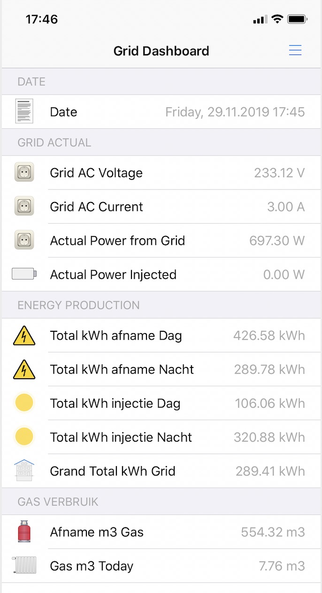
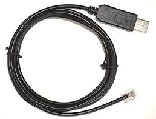
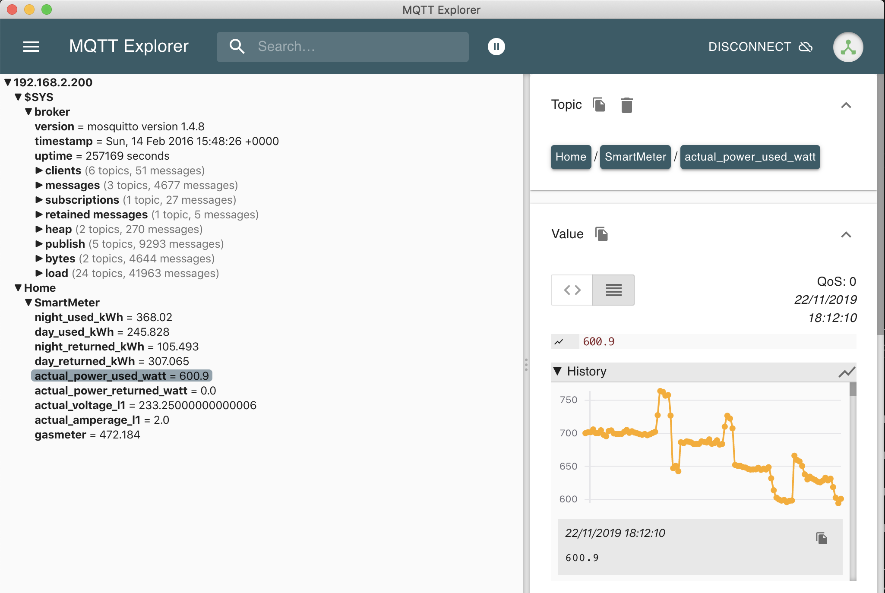
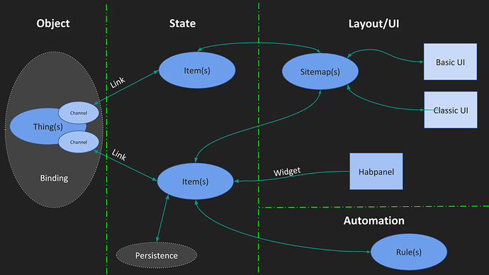
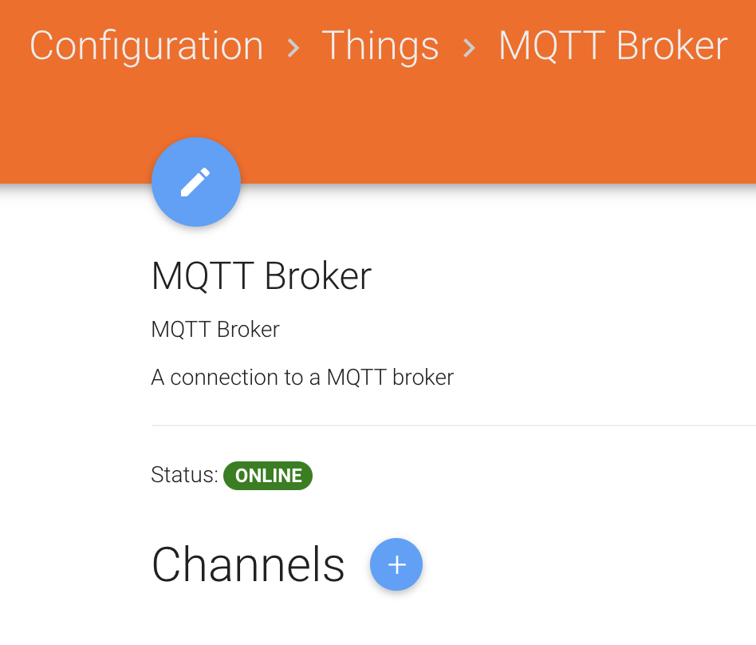
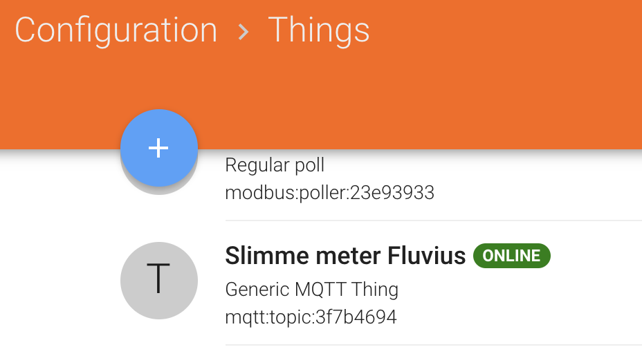
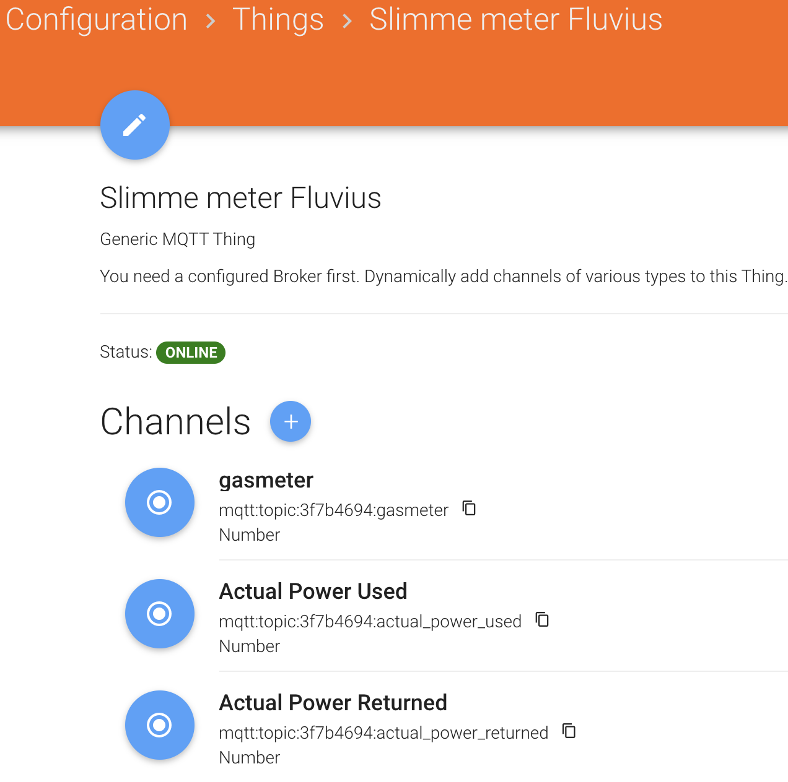

# How to make your Fluvius P1 port data available via MQTT

**TOC :**

    1. Context
    2. Architecture
    3. P1 port reader Fluvius Smart Meter
    4. MQTT
    5. Connecting to Openhab
    6. Connecting to AWS

**Remark:** This repo is mainly based on an existing solution for the Dutch market by [Mosibi](https://github.com/Mosibi/p1-smartmeter). We adapted it in order to make it work for the DSMR meter of Fluvius, used in the Flanders region.

**Changes:**

    - OBIS object in the YAML file.
    - can read a file with a telegram for test purposes.

**Openhab Dashboard:**



## 1. Context

### 1.1 Fluvius Smart Meter

The Fluvius Smart meter communicates via the 'P1 port':

    - Hardware: P1 port = serial interface with RJ12 connector
    - Protocol: uses a combination of DSMR 5 standard + eMucs specification

**Problem:**

    - Hardware: P1 serial signal is **'Inverted'**. Thus can not be connected directly to a RS232 port of RaspberryPi or microcontroller (eg: ESP32, arduino etc). Extra hardware is needed to 're-Invert the signal !!

    Solution = special cable (see 3.1 ) which has a chip to re-invert while making USB signals

    - Protocol: The used protocol is a 'mix' of both specifications. As a result all nice 'Dutch' opensource solutions for reading the Smart meter don't work or only partially.

    Solution = I merged both specifications into a new version of 'OBIS' object file in order to be able to have the right 'OBIS' object model for the 'Fluvius P1 telegrams'. This does not solve the whole problem but is an important piece of it.

    - Openhab: The openhab DSMR 5 BINDING, this is the openhab middelware to connect to the P1 port, also follows the DSMR 5 spec and can only read parts of the Fluvius telegrams.

**Solution:** The approach I took was to 'decouple' the problem via MQTT since rewriting a new openhab binding was no option.

**First part** of the solution is, while adapting an existing opensource initiatif (see ref), a python app on a rasspberrypy that reads the telegram, converts it following the 'Fluvius OBIS' object model and then sending this readings over MQTT to a 'MQTT broker'.

**Optional** you can also run this python app as a Linux service, so it can nicely run in the background and will automatically start if Pi is rebooted.

**Second part** is relatively easy. We have to configure openhab to connect to the 'MQTT broker' and read the 'published' messages.

### 1.2 Files

- [example of Fluvius P1 telegram + explanation](https://github.com/tribp/DSMR-Fluvius-MQTT-Openhab/blob/master/Doc/SM_raw%20%2B%20uitleg.docx)
- [example of 'raw' Fluvius P1 telegram ](https://github.com/tribp/DSMR-Fluvius-MQTT-Openhab/blob/master/Doc/SM_raw.txt)
- [DSMR 5 standard](https://github.com/tribp/DSMR-Fluvius-MQTT-Openhab/blob/master/Doc/Slimme_meter_15_a727fce1f1.pdf)
- [e-Mucs speccification](https://github.com/tribp/DSMR-Fluvius-MQTT-Openhab/blob/master/Doc/e-MUCS_H_Ed_1_3.docx)

### 1.3 References

- [P1 Reader - (for Dutch Market)](https://github.com/Mosibi/p1-smartmeter) -> Startpoint for this solution!
- [Tool for MQTT debugging ! Super Good !](http://mqtt-explorer.com/)
- [BK Hobby workshop for MQTT and Openhab](https://www.youtube.com/watch?v=f9DlvG3UQuQ) -> Pretty long but BK Hobby on youtube is excellent to start mastering openhab.

## 2. Architecture

Architecture:  


## 3. P1 port reader Fluvius Smart Meter

**Intro:** Starting point was the P1 reader for the Dutch market. This is a python app, with very clean code !, that reads the telegram, according the DSMR 5 OBIS object model in a 'yaml' file and then publishes the readings to a MQTT broker.

What we changed:

    - OBIS object model according to the Fluvius specifications.
    - additional 'debug' feature for reading from file

**Remark:**

I also tried to bundle it into a docker container but finally did not because:

- USB serial port: Tunneling a hardware port into a docker container is feasable but cumbersome and since the program is relativly small it was not a big win.

```
# You need '-v /dev/ttyUSB0:/dev/ttyUSB0' to map your HW port into a container: eg ttyUSB0

```

- 'systemctl': When turning a app into a service we need 'systemctl' , as part of systemd. I read that it is possible but not recommended since it is a part of the Linux kernel and is therefore deliberately not made avilable in containers.

### 3.1 Testing your Serial Port

First install the cable between the P1 port and the USB of your raspberry

Next: normally your (default) serial port will be 'ttyUSB0'. Issue the command and you should see the telegram messages on your screen.

```

cat /dev/ttyUSB0
```



### 3.2 Install all Python dependencies + config in YAML file

**Python libraries**

- install Python3

```
# Install the required Python Libraries used in the program

sudo apt-get install python3-serial python3-pip python3-yaml
sudo pip3 install paho-mqtt
```

**Config of MQTT broker + desired P1 available parameters**

- edit 'p1_fluvius_smarmeter.yaml'

```
        mqtt_username: 'p1'                 -> optional - depends only needed if set at broker
        mqtt_password: 'password'           -> idem
        mqtt_host: '192.168.2.200'          -> Ip address of MQTT broker
        mqtt_topic_base: 'Home/SmartMeter'  -> base: this wil prepend your topics set in 'yaml' file
        serial_device: '/dev/ttyUSB0'       -> mostly if raspberrypy with USB cable
        serial_baudrate: 115200             -> needed
```

- edit 'p1_fluvius_smartmeter.yaml: set per OBIS parameter if 'Publish=True/False' and time interval

PS: settings in 'yaml' file in src is for a standard monofase Fluvius E-meter + Gas-meter and reads most important parameters in telegram.

### 3.3 How to install or run the Python app

You can run it locally, as described below, but running it as a 'Linux service' is prefered ! (see 3.4)

Running it locally might be good to test, debug and or read a file with a 'test' telegram and thus no need for using the serial port.

**Run it**

```
# Remark: Edit 'p1_fluvius_smartmeter.py' to point to the correct location of the 'p1_fluvius_smartmeter.yaml' file

python3 p1_fluvius_smartmeter.py
```

### 3.4 How to install the python app as a Linux service

Th installation procedure is identical as in the origanal version of the 'p1-meter' of [Mosibi](https://github.com/Mosibi/p1-smartmeter). First we need to install the Python dependencies, next we install it as a service.

```
# Install the Python app as a Linux service
# Do git clone .. or copy the Make file + put app and yaml file in 'src subdirectory'

git clone https://github.com/tribp/DSMR-Fluvius-MQTT-Openhab.git
$ vi p1_smartmeter.yaml             -> change IP of your MQTT Broker + user/passwd
$ sudo make install                 -> Install it as service (see ho in Makefile)
```

**Tip:** use 'scp' (= secure copy within SSH) to transfer your file from your laptop to the Pi. This is not needed if you directly clone the repo onto your Pi!

```
scp /Users/tribp/Library/Mobile\ Documents/com\~apple\~CloudDocs/Data/R\&D/GitHub_Projects/Public\ Repos/DSMR-Fluvius-MQTT-Openhab/Makefile pi@192.168.2.150:~/p1-smartmeter

scp /Users/tribp/Library/Mobile\ Documents/com\~apple\~CloudDocs/Data/R\&D/GitHub_Projects/Public\ Repos/DSMR-Fluvius-MQTT-Openhab/src/* pi@192.168.2.150:~/p1-smartmeter/src
```

**Start the service**

```
sudo systemctl start p1_fluvius_smartmeter.service

# Check if service is running
sudo service p1_fluvius_smartmeter status
```

## 4. MQTT

### 4.1 Intro

MQTT is a very leightweight 'Pub-Sub' mechanism. First you have a 'broker', this is a server, that is the centre of the architecture. Secondly you have 'clients' that 'publish' (Pub), 'subscrib'(Sub) or both to certain 'Topics'. Topics can be seen a classic 'radio channels', like '/Home/Grid/Voltage' or '/Home/Solar/Current'. A smart meter will 'Publish' on '/Home/Grid/Voltage' the values and a client (eg Openhab Dashboard) can 'subscribe' to the channel in order to receive those values and show them on the dashboard or take some action.

### 4.2 MQTT tools

'MQTT.fx' is a very usefull tool but 'MQTT explorer' is even beter. It shows all available topics, the payload details, history etc. this makes it the ideal tool for development or debugging.



### 4.2 Broker Options

Here you have endless options: your home NAS, a broker within Openhab, a broker on your Raspberry, directly or in a Docker container or ...

## 5. Connecting to Openhab

```
Things          -> eg: Smart Meter itself
channel         -> parameter of a 'thing' (eg: Volt, current, kWH injected,,..)
item            -> 'state' of a channel (eg: Volt= 232,4V)
rule            -> actions for automation: when .... then ....
persistence     -> data repository: InfluxDB, MongoDB, AWS DynamoDB,....
sitemaps        -> Dashboards

```



### 5.1 intro

As mentioned before, the existing DSMR 5 binding in openhab is designed for the Dutch P1 telegrams but not for the Fluvius telegrams in Flanders.

Therefore we will 'install' and use the MQQT binding in Openhab.

**Install MQTT binding**


Configure the broker with IP address and standard port 1883.

**Do not add any channels on broker, this will be done on smart meter 'Thing' !**



### 5.2 Smart meter 'Thing' and channels

**Important:** We will now add a thing 'Fluvius Slimme Meter' and add many 'channels'. Each channel will represent a parameter of the smart meter: 'Actual Voltange', 'current', etc



Add all the channels you want, available from the meter. (See also the OBIS object)



### 5.3 Items

We will define all 'items' in the [Emeter.items](https://github.com/tribp/DSMR-Fluvius-MQTT-Openhab/blob/master/Openhab/Emeter.items) file.

### 5.4 Openhab UI

We will define all dashboard in the [Grid.sitemap](https://github.com/tribp/DSMR-Fluvius-MQTT-Openhab/blob/master/Openhab/grid.sitemap) file.

## 6. Connecting to AWS

Todo: document
